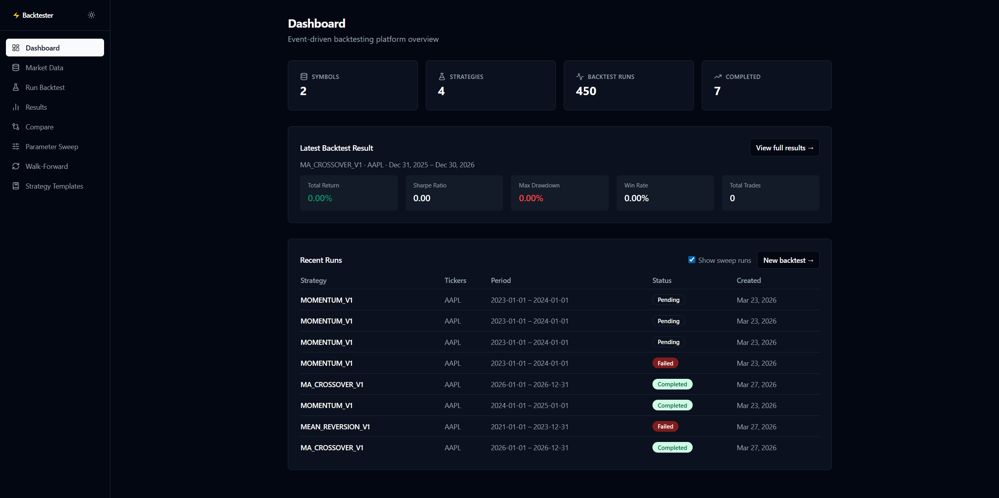
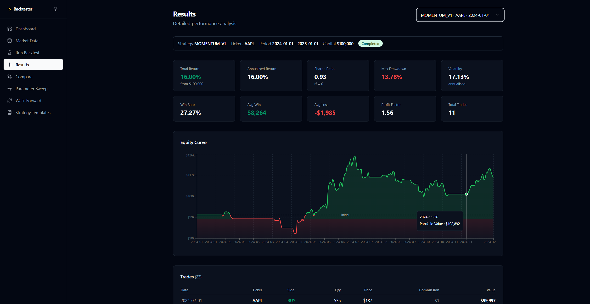
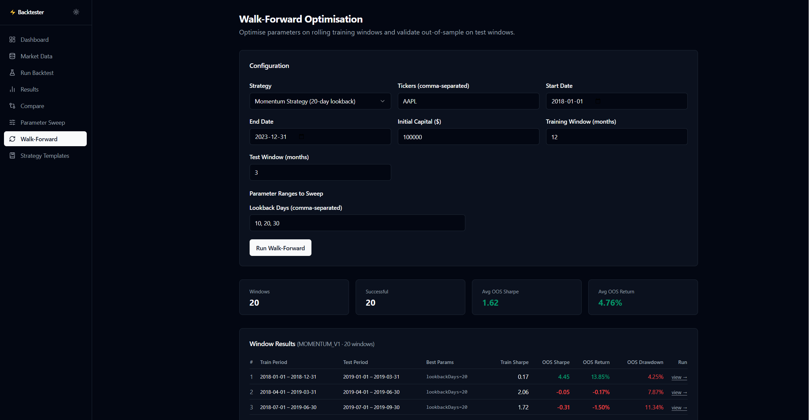

# Event-Driven Trading Strategy Backtester

A full-stack quantitative research platform for backtesting, optimising, and comparing algorithmic trading strategies against historical market data.

Built with Java 21 + Spring Boot on the backend and React + TypeScript on the frontend.



---

## Why

Most backtesting tools are either black boxes or Python notebooks — great for exploration, but not for demonstrating software engineering rigour. This project was built to show what a production-grade backtesting system actually looks like: a clean domain model, an event-driven simulation core, a proper port/adapter architecture, and a research UI that surfaces meaningful results.

The simulation enforces strict causal ordering — no look-ahead bias. Each trading day processes market data → strategy signals → orders → fills → portfolio update, in that sequence, using an in-memory event queue.

---

## What

### Features

- **4 built-in strategies** — Momentum, Mean Reversion (Bollinger Bands), RSI, and Moving Average Crossover, all parameterizable at runtime
- **Real market data** — fetches daily OHLCV bars from Yahoo Finance automatically when running a backtest
- **Multi-ticker portfolios** — backtest across a universe of tickers simultaneously; strategies receive the full daily universe and can implement cross-asset logic
- **Correlation-aware position sizing** — reduces allocation to assets that are highly correlated with other signals on the same day, using Pearson correlation over a rolling 20-day window
- **Parameter sweep** — runs every combination of a parameter grid and ranks results by Sharpe ratio
- **Walk-forward optimisation** — splits the date range into rolling train/test windows, finds the best parameters in-sample, and validates them out-of-sample
- **Performance metrics** — total return, annualised return/volatility, Sharpe ratio, max drawdown, win rate, profit factor, and optional CAPM alpha/beta vs a benchmark ticker
- **Strategy templates** — save named parameter configurations and reuse them across backtests
- **Full REST API** with OpenAPI/Swagger UI at `/swagger-ui.html`
- **React frontend** — equity curve charts, side-by-side run comparison, sweep rankings, walk-forward window results

### Architecture

Five-layer hexagonal architecture. The domain layer has zero Spring, JPA, or Jackson imports — it is plain Java 21 and fully unit-testable without a Spring context.

```
api.*            REST controllers, record DTOs, @ControllerAdvice
application.*    EventLoop, BacktestExecutor, SweepService, WalkForwardService, MetricsCalculator
domain.*         Records, sealed events, Strategy interface — no framework dependencies
infrastructure.* JPA entities, Flyway migrations, Spring Data repos, Yahoo Finance adapter
strategy.*       @Component beans implementing Strategy (auto-discovered via List<Strategy> injection)
```

**Event loop (per trading day):**
```
MarketDataEvent (per ticker)
  → strategy.onDay(date, universe, portfolio)
    → SignalEvent(s)
      → PositionSizer → OrderEvent
        → slippage + commission → FillEvent
          → portfolio.applyFill()
              → portfolio.takeSnapshot(date)
```

**Tech stack:**
| Layer | Technology |
|---|---|
| Language | Java 21 |
| Framework | Spring Boot 3.2 |
| Database | PostgreSQL 16 (schema managed by Flyway) |
| ORM | Spring Data JPA / Hibernate 6 |
| Frontend | React 19, TypeScript, Vite |
| Data fetching | TanStack Query, Axios |
| Charts | Recharts |
| UI | Tailwind CSS, Radix UI |
| Containerisation | Docker + Docker Compose |

### Strategies

| ID | Name | Signal logic |
|---|---|---|
| `MOMENTUM_V1` | Momentum | BUY if N-day return > 0 and flat; EXIT if return < 0 |
| `MEAN_REVERSION_V1` | Mean Reversion | BUY if Bollinger z-score < −2; EXIT if z-score ≥ 0 |
| `RSI_V1` | RSI | BUY if RSI < oversold threshold; EXIT if RSI > overbought threshold |
| `MA_CROSSOVER_V1` | MA Crossover | BUY on golden cross (short SMA > long SMA); EXIT on death cross |

All strategies implement a single interface and are parameterizable at runtime — no redeployment needed to change lookback windows or thresholds.

**Results — equity curve, metrics, and trade list:**



**Walk-forward optimisation — out-of-sample validation across rolling windows:**



---

## How to run

### Option 1 — Docker (recommended)

Requires [Docker](https://docs.docker.com/get-docker/) and Docker Compose.

```bash
git clone https://github.com/zouheirsidani/event-driven-backtester.git
cd event-driven-backtester
docker-compose up
```

The app starts at `http://localhost:8080`. Flyway runs migrations automatically on first boot.

### Option 2 — Local development

**Prerequisites:** Java 21, Gradle, Node 18+, PostgreSQL 16 running on `localhost:5432`

```bash
# 1. Start only the database
docker-compose up postgres

# 2. Run the backend
./gradlew bootRun

# 3. In a separate terminal, run the frontend dev server
cd frontend
npm install
npm run dev
```

Frontend dev server starts at `http://localhost:5173` and proxies `/api` calls to the backend.

### Running tests

```bash
./gradlew test
```

### API documentation

Swagger UI is available at `http://localhost:8080/swagger-ui.html` once the app is running.

---

## Project structure

```
src/
  main/
    java/com/backtester/
      api/                  # Controllers, DTOs, mappers, exception handling
      application/          # EventLoop, services, metrics calculator, port interfaces
      domain/               # Records, sealed classes, Strategy interface
      infrastructure/       # JPA entities, Flyway, adapters (DB + Yahoo Finance)
      strategy/             # Built-in strategy implementations
    resources/
      db/migration/         # Flyway V1–V7 SQL migrations
  test/
    java/com/backtester/    # Unit tests (EventLoop, Portfolio, Metrics, MomentumStrategy)
frontend/
  src/
    pages/                  # Dashboard, RunBacktest, Results, Compare, Sweep, WalkForward, ...
    components/             # Layout, StatusBadge, Radix UI primitives
    lib/                    # api.ts (Axios client), types.ts, utils.ts
```
